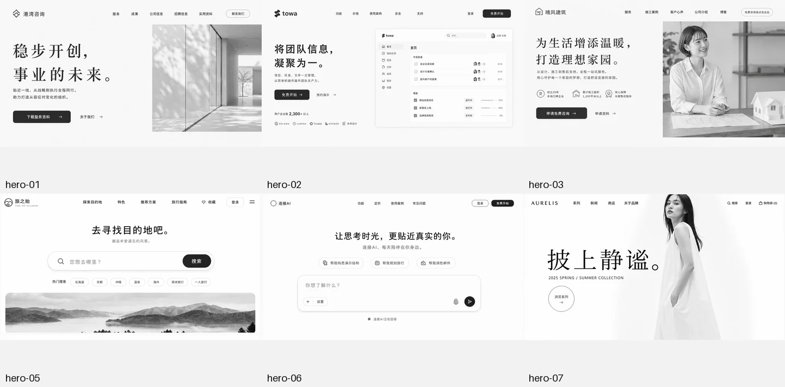
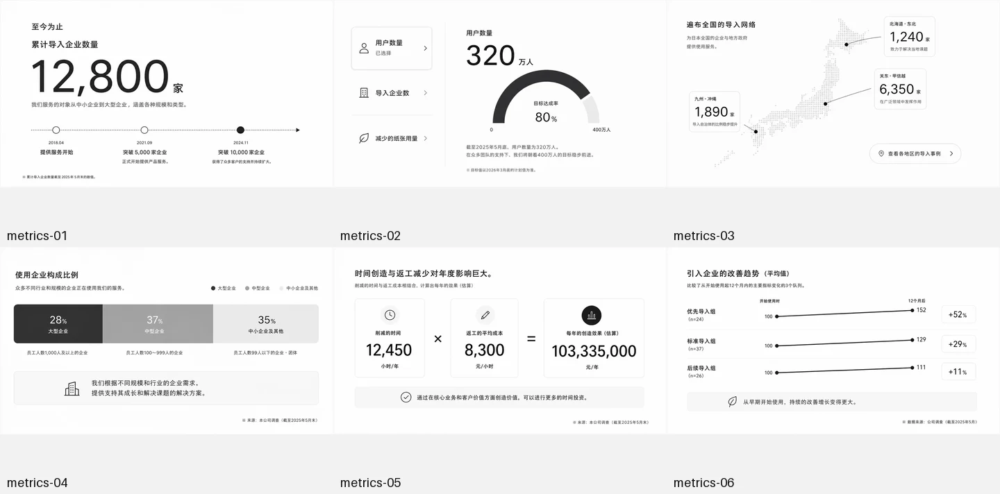

# Section Sprinkles ✨

[简体中文](README.md) · [English](README_EN.md)

## **一座面向中文产品与设计团队的网页区块灵感库**

**536 个中文网页区块设计参考 · 16 类常见场景 · 全量结构化标签**

帮助设计师、产品经理和开发者快速比较信息层级、版式、配色与视觉节奏，从参考图中找到适合自己的设计方向。

新设计请把图片作为灵感参考；如果只翻译图片文字，则保持原有风格、版式、颜色、图片和尺寸不变。

## 如何使用

- 在 `gallery/` 中按区块类型浏览。
- 在 `manifest.json` 中按分类、编号或标签查找。
- 使用 `scripts/query-gallery.py` 组合筛选条件。

每张图片都有布局、风格、元素、信息密度、语气和适用场景标签；完整说明见 `tag-taxonomy.json`。

```bash
python3 scripts/query-gallery.py \
  --category hero \
  --layout split \
  --element portrait \
  --density low
```

## 在 AI 工具中使用

支持 Codex、Claude Code、WorkBuddy / CodeBuddy Code 等能够使用 Skill 的 AI 工具。

把下面这句话发给 AI，即可完成安装：

> 请帮我安装这个 GitHub 仓库里的 `section-sprinkles` Skill，安装完成后告诉我怎样直接用自然语言使用它：https://github.com/war3shenzuo/section-sprinkles

安装后直接用自然语言，例如：

- “帮我挑选 3 个低信息密度、带人物照片的中文首屏参考。”
- “把 `hero-07` 中的文字替换成中文，其他视觉元素保持不变。”
- “参考 `hero-07`，为我的产品设计一个原创中文首屏。”

## Demo

### Demo 1：极简首屏候选

“首屏 + 极简风格”得到 6 个候选。[查看筛选记录](demo/search-results/)。



### Demo 2：B2B 数据成果候选

“数据成果 + 图表 + B2B + 理性语气”得到 6 个候选。[查看筛选记录](demo/b2b-metrics/)。



另外提供一个 [可运行的响应式前端实现 Demo](demo/travel-search/)。
