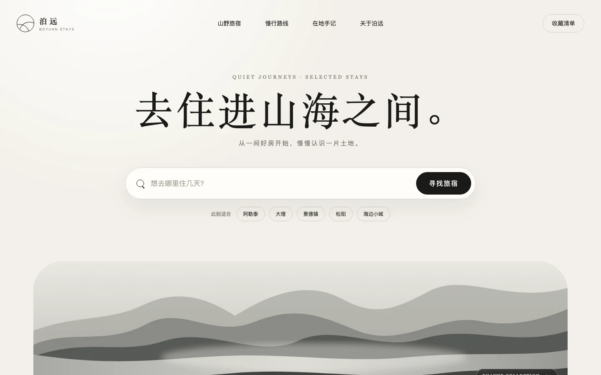

# 精品旅行搜索首屏 Demo

这个 Demo 展示如何从一句 `$section-sprinkles` 请求出发，筛选参考并完成一个可运行的响应式首屏。

## 输入

```text
$section-sprinkles 帮我找一个留白充足、带搜索框、适合精品旅行服务的中文首屏参考，并用纯 HTML/CSS 做成响应式 Demo。
```

## 选择

- 参考：[`hero-05`](../../gallery/hero/hero-05.webp)
- 保留的设计逻辑：居中信息层级、大面积留白、胶囊搜索框、快速筛选标签、单色风景视觉
- 原创适配：品牌、文案、山景插画、动效、移动导航和搜索反馈

## 结果



直接用浏览器打开 [`index.html`](index.html)。页面不依赖框架、构建工具或外部图片服务，并包含响应式布局、减少动态效果偏好和基础键盘可访问性。
